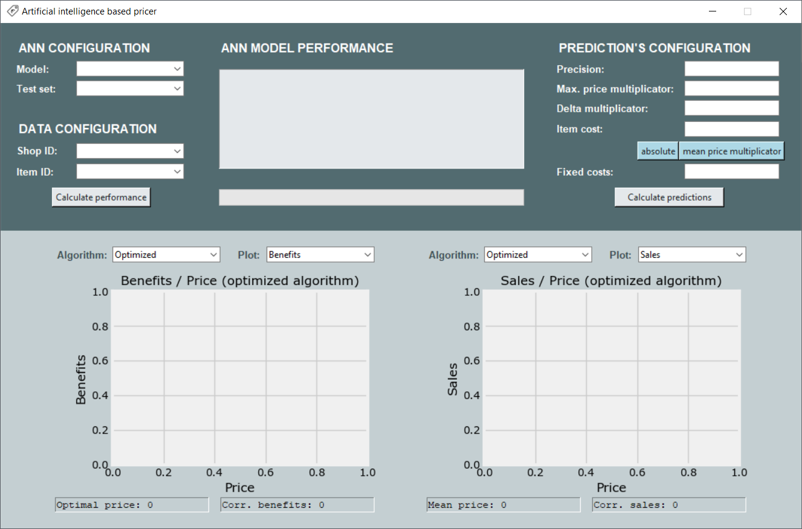

# Artificial Intelligence Based Pricer
## Introduction
This project consists of two applications. The "Data Processing Tool" and the "Pricer App".

#### Data Processing Tool
This program is used to treat and transform the data into two csv files (training and testing sets) with variables as columns and observations as rows. Both are meant to be treated afterwards in ANN_development.py file located in Pricer_App directory to get standarized, shuffled and the shuffled training set also devided in training and validation sets. After these modifications and within the same python file an artificial neural network can be developed.

#### Pricer App
This program is based on artificial neural network and it predicts optimal price for a product for the next month. There are two available prediction algorithms:
1) The pure ANN based one, which highly depends on the data the model was trained on, because if the model had not seen unusual situations, such as a price much higher than the mean, it will not able to show the realistic price-sales relation curve and, therefore will not give us any usefull results.
2) The optimized one. This algorithm forces the price-sales relation curve to be always descending and allows to enhance the slope multiplying the difference in sales between two adjacent possible prices by "Delta multiplicator" parameter. The mean price is taken as a starting point for both directions.

 

## Instructions to run the programs
**Note that the executable .bat files will only work on Windows OS. If you are using different OS you may want to run the applications from an IDE.**

#### Data Processing Tool
1) You should have insalled and set up in your local machine: Spark, scala, java and sbt.
2) Double click on Data_Processing_Tool.bat.

#### Pricer App
1) You should have insalled and set up in your local machine: Anaconda3 and keras (python library). The Pricer_App.bat calls to anaconda prompt, so if you don't have it, you can run the app from your IDE or modify the Pricer_App.bat.
2) Double click on Pricer_App.bat.
 

## Instructions to use the programs
#### Data Processing Tool
If the programs finds that in the Files/Completely_processed_data directory already exist files with the correct format, it will will show them to you a
When you open the program you are asked if you want to process the data. To interact with the app you should indtroduce the index of an option you want to execute or a value you are asked for. The complete process may take hours and even days depending on how many data you want to process and on the computational power of your machine, so some of the steps are saved in files in the Files directory and can be reused by the program.
All the files share one of the following naming conventions: *fileName_timeWindow_numberOfShopsUsed_numberOfItemsUsed.csv* or *fileName_numberOfShopsUsed_numberOfItemsUsed.csv*

#### Pricer App
To calculate the ANN model performance you should select from the dropdown lists the model and the testing set. To calculate the predictions all the parameters should be introduced or selected. Parameters list:
1) **Model.** The model of an ANN to be used in the calculations. The naming convention used for the model is: *modelName_MeanSquaredErrorOnValidationSetMultipliedBy10000*.
2) **Test set.** The testing set that contains the data to be used in the in the calculations.
3) **Shop ID.** The ID of the shop you want to get the results for.
4) **Item ID.** The ID of the item you want to get the results for.
5) **Precision.** The number of possible prices to be checked (Integer).
6) **Max. price multiplicator.** The mean price among all the shops for the selected product is multiplied by this parameter (Double) to get the maximum possible price to calculate the sales predictions for.
7) **Delta multiplicator.** The differences in sales between the possible prices (between 0 and the maximum price) are multiplied by this parameter (Double) to get enhance the slope. This is only taken in to account by the optimized algorithm.
8) **Item cost.** The cost per sold item (Double).
9) **Absolute / Mean price multiplicator.** Affects the "Item cost" parameter. If "absolute" is selected, the "Item cost" is considered to be expressed in money (Double). If "Mean price multiplicator" is selected, the "Item cost" is considered to be a multiplicator of the mean price and should have values between 0 and 1 (Double).
10) **Fixed costs.** The total amount of the costs independent of the number of the units sold (Double).

To explore the calculated predictions you have two plots for which you can select the type of the algotithm (optimized or not) and the type of the plot (benefits of sales).
